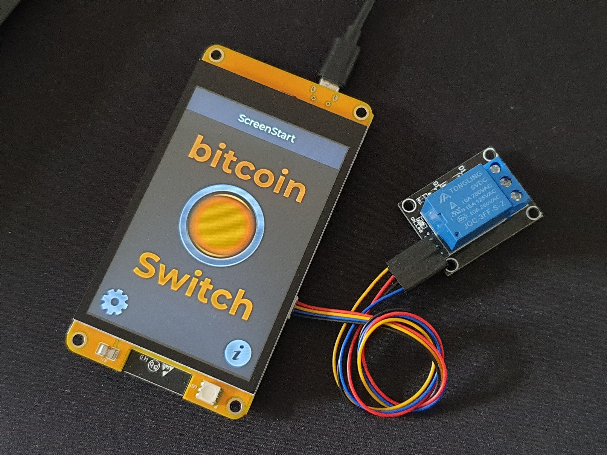

# offline⚡️Switch

<!--- --->

#### Demo Video: <video width="360" height="740" controls autoplay>

<source src="installer/assets/DemoVideo.mp4" type=video/mp4>
</video>

## Short description

The offline⚡️Switch is a bitcoinSwitch with an ESP32-based smart display (made by Sunton). It is based on the offline payment functionality of bitcoinVend or LNPoS. The offline⚡️Switch itself does not need to be online, only the payer. The offline⚡️Switch can display a QR code (LNURL) on the display. The user's wallet scans the QR code and connects online to the LNbits server. If the Invoice has been paid, the user is shown a "secret" as a four-digit PIN. If this PIN is entered via the touch panel into the offline⚡️Switch, then the condition is fulfilled for him and the switch is switched. The configuration can be done exclusively via the display, which considerably reduces the technical requirements. As a basis for this smart display project I could use the BliksemBier from Pieter.

## Requirements

- Sunton 3.5" 320\*480 Smart Display ESP32-3248S035 (with R for Resistive or C for Capacitive (recommended) Touch Screen [e.g.](https://de.aliexpress.com/item/1005004632953455.html)
- 5V Relay (High-Level-Triggered) [e.g](https://www.az-delivery.de/products/relais-modul)

## Relay connection

The connection of a relay is quite simple. The supplied cable is sufficient. The classic 5V relays usually have three connections. Supply (5V), Ground (GND) and Signal (Sig). The ESP32 delivers only 3.3V, but for most 5V relays this should be enough. Connect `3,3V` (red), `GND` (black) and the signal `IO21` (yellow) as shown in the picture. The blue line for IO22 remains unused here.

## How do I set up the offline⚡️Switch?

1. Flash the firmware on the ESP32
2. Create and set up a LNbits wallet
3. Configure the offline⚡️Switch via the touch display

For a detailed description see my website: [ereignishorizont.xyz/offlinelnswitch](https://ereignishorizont.xyz/offlinelnswitch/en/)

Direct access to the web installer can be found here: [web installer](https://ereignishorizont.xyz/installer/offlineLNSwitch/index.html)

## License

This is FOSS according to MIT license. For those who want to clone and edit it themselves, here is some information:

As development environment (**I**ntegrated **D**evelopment **E**nvironment) I would recommend [PlatformIO](https://platformio.org/platformio-ide) on [VSCode](https://code.visualstudio.com/). As a graphical user interface [LVGL](https://lvgl.io/) (**L**ight and **V**ersatile Embedded **G**raphics **L**ibrary) was used and mostly created by the application [SquareLine Studio](https://squareline.io/).

## Aknowledgement

This project use bits from
[BliksemBier](https://github.com/pieterjm/BliksemBier) from Pieter and
[bitcoinVend](https://github.com/arcbtc/bitcoinVend) from Ben Arc

## Donations/contributions

Donations and contributions are welcome.

Lightning⚡Address: <axelhamburch@ereignishorizont.xyz>
